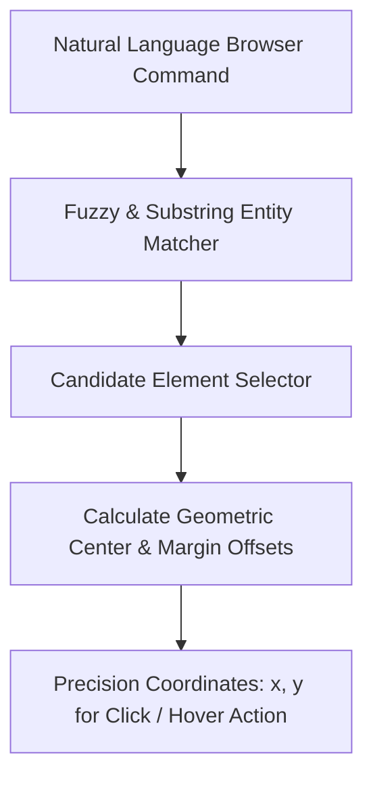

# GenPark AI Agent Skill - Vision Web Action Bounding Box Grounder

Resolves natural language browser directives to exact spatial (x, y) click targets and bounding boxes.

Verified by [GenPark AI](https://genpark.ai) and compatible with [Model Context Protocol (MCP)](https://genpark.ai/mcp).

## Architecture Diagram

## Features
- **Spatial Center Computation**: Converts relative box boundaries to exact mouse cursor targets.
- **Zero External Dependencies**: Pure Python standard library implementation.
